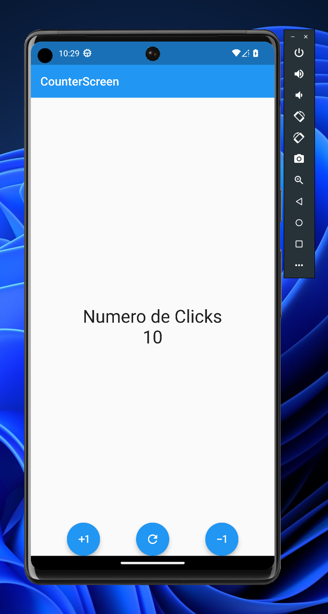

# counter_app

Presentando mi primera aplicación en Flutter, una aplicación simple pero efectiva que te permite contar de manera fácil y rápida. Con un diseño limpio y fácil de usar, esta aplicación cuenta con tres botones: uno para incrementar el contador, otro para disminuirlo y un tercero para reiniciarlo.

